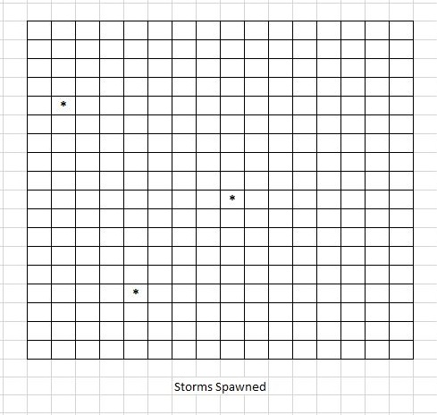

# CavemanWorld
[Link To A Demonstration Video](https://www.youtube.com/watch?v=FU3Tt19u90k)

[Link to Download the "game"](DynamicCavemanWorld/Builds/GameBuild.rar)
* Note: Once at the page click download to download a build of the game.
## Premise
> A random world generator for an ultimate game that would have the player playing a tribe (or tribes) in the era of man's transition from Hunter-Gatherer Stone Age into the early Agricultural Civilizations of the Stone, Bronze, and Early Iron Ages.
>
> The world itself is a Civilization-like square map, where instead of the squares being set in stone at the beginning of the game, the world is evolving constantly in response to changes in climate, and the effects of the player.  The world experiences a 120-day year.  Each tile generated is approximately 400 ft by 400 ft.  The goal eventually is to be able to generate world of size 250 x 250 tiles in a reasonable time period.
>
> Each square's habitat, food and creature availability are determined by the weather, rainfall, and rivers.  Rivers flow based upon the terrain and rainfall and allow for seasonal flooding.
>
> Creatures will either live as solos spread with certain densities across a single tile calculated from the habitat or in herds/tribes that wander in groups from tile to tile in search of resources (primarily food, water, and shelter).
>
> People will live in tribe "herds".  Ultimately, they are to have a cultural evolution system which will allow new cultures to appear and disappear and change over time.

## Present Product
Current Features:

* Allows camera navigation of the screen with standard ASWD keyboard controls.
Q, E, allows for left-right rotation.
TAB, R allows for up-down rotation.
LEFT-SHIFT, LEFT-CTRL are zoom-in and zoom-out respectively.
* Opens by loading a pre-created 50 x 50 world that contains some variety of lands and habitats.
* Randomly generates worlds of any customizable size.  However, reasonable time margins (i.e. less than a minute of generation time) only exist for worlds smaller than 150 x 150.  (Note:  The worlds can have lopsided dimensions, i.e. 40 x 70)
* Time to generate a new year presently is about a sec for 50 x 50 worlds, but seems to be growing at O[n^2] presently.  (Ideally eventually this process can run in the background during the present year experienced so it will be a non-factor.  However, this is the main limiting factor in world generation since all new worlds are run for 20 years prior to being displayed to generate starting habitats.)
* Presently, the world has been simulated for 20 years prior to when it first appears upon the screen.  The percentages of the habitats given correspond to the percentages of time the square fell into the appropriate habitat groupings.
* Allows the advancement of time Day-by-Day, and Year-By-Year.
* Mousing over a particular tile provides a display of that tile's properties on the current day of that year.  This information includes: 
  * Habitat Percentages 
  * Elevation, Temperature, & Rainfall
  * Surface-Water (i.e. River or lake water level)
  * River flow input direction, River flow output direction
  * Hill Percentage (a measure of roughly how hilly the terrain is).
* Rivers flow downhill and water contained in them drains away in soil and evaporates according to scientific principles.
* A crude visualization of the elevation and habitat maps has been created including a button allowing for a toggle between the visualization modes.

## Simulation Logic
### Layer Generation Technique:
>
> This technique is used to calculate values for almost all tile information at the base level of the world such as Elevation, HighTemp, LowTemp, Humidity Layers, etc.

> A random number is generated within certain bounds for the initial value in the upper left corner.
Then the top row is generated.  Each new square is dependent on the value in the square directly to its left. The new value is generated around the old value +/- x; where x is a random number between some limits.
>
The same process is repeated using the square value directly above the present square to generate the values in the first column.
>

>
For all subsequent squares, one of the four squares (left, up-and-left, up, and up-right) are chosen randomly.  To find the value of the new square, the value of the randomly chosen square is added to a random +/- x.
>
This allows for gradual change in most situations, but allows for a large difference to grow between adjacent regions as well.  This process allows the world to ocassionally generate cliffs and very steep slopes, while the majority of terrain is similar to that terrain around it.
>

### Rainfall Generation Technique
>
Six humidity waypoints are generated for each square.  They guide the humidity value throughout the year.  The waypoints correspond to six days of the year, namely: day 1, day 21, day 41, day 61, day 81, and day 101.  The actual humidity value for a given day in the year is calculated as a point found on the straight lines connecting the points on these graphs.  These humidity values are used to calculate the chance of a storm spawning on a given tile, and the chance it will spread away from a given tile.
>

>
Using this humidity value there is an x % chance of a storm being generated on a tile each day.
>

>
Each storm has a y % chance (also calculated from the humidity value) to spread out from its point of origin to other squares.  The storm will weaken and become less likely to spread the further it spreads out from the initial spawn point.
>

>
This is carried out for all storms spawned on a given day.  These storms deliver rainfall to the tiles in a manner that is logically consistent with storms spreading over an area and also allows for regional and season variation in rainfall, with a certain amount of randomness as well.

### Hill Percentage Calculation
>
Once the entire Elevation Map has been generated, the maximum average absolute difference in elevation of all the squares around each square is found.  That square will have 100% hill percentage.  All other squares "hilliness" is measured as a percentage of that average absolute difference over the maximum average absolute difference.  "Hilliness" is used to calculate water flow rates from rivers, drainage rates, rockiness (i.e. stone and metal resources available), and the amount of passable terrain on a square.

### Rivers
The premise of rivers is as follows:

1. Rivers empty into the sea.
2. Rivers lose water to evaporation.
3. Rivers lose water to soil absorption.
4. Rivers gain water from precipitation runoff.

Other factors I either will or wish to take into account in the future are:

* Rivers gain water through snow-melt.  (Math complete, but not implemented in present product)
[Link to the full experimental excel file without macros enabled](ReadmePics/RevisedWeatherGraphsTest.xlsx)
* Plant-life absorbs and traps water in its soil thus increasing soil absorption.  (Ambition not yet attempted)

I shall expand upon how the above premises are implemented.

* Rivers empty into the sea:  
  * Rivers only flow downhill in the game to one tile directly adjacent (up, left, right, down) to themselves, no more.  
  * The rate of this flow is determined by the hill percentage.  The higher the percentage the steeper the land is assumed to be, thus more speed is added to the water flow.

* Rivers lose water to soil absorption:  
  * It is assumed that rocky soils will absorb less water, as there are less gaps in the soil for water to collect.  A "hillier" square is assumed to have more rocks in its soil.  Thus, a higher hill percentage square can absorb less water because it has less gaps available for water storage.  
  * This water absorption is capped at a particular rate which is absorbed every day regardless of how much water is on the surface.  
  * If there is no space below ground this water will sit above ground and drain into ponds, lakes, creeks and rivers.

* Rivers lose water to evaporation:  
  * Standing bodies of water lose water to evaporation.  There are many factors involved in this calculation.  For full details of my research on this matter see [this link](http://www.engineeringtoolbox.com/evaporation-water-surface-d_690.html) for the mathematics I adapted to how temperature and humidity effect evaporation rates.  
  * The general idea being that more water will evaporate in a hot dry climate than in a cold wet one.  
  * I modeled the standing water universally as a river containing a volume of water in (for simplicity's sake) an inverted triangular pyramid of depth approximately 1/3 the width of the river and length the entire length of the tile i.e. 400 ft.  I used basic geometry to then calculate the surface area this volume of water would expose for evaporation. 
  Given a Volume V, and a river Length L in feet, this equation gives the SA available for evaporation:

  
  

  * Using the simplified models (ignoring factors like wind-speed and approximating humidity based on my Humidity layer and whether it is rainy, cloudy or sunny that day for example) given on [this website](http://www.engineeringtoolbox.com/evaporation-water-surface-d_690.html) I was able to calculate the evaporation of river water on a given day from the river.
* Rivers gain water from precipitation runoff:  
  * This means all rainfall is added directly to the river.  
  * No time delay for drainage was implemented for simplicity's sake.  
  * Ultimately precipitation occurring at temperatures below 32-degrees will not be added because it will be on the surface as snow.  
  * Snow melt will then occur using the model found at [this website](https://www.cs.utah.edu/~shirley/papers/snowTerrain/terrain-node10.html) and be added to the river water allowing for the possibility of spring flooding events.  These store water for use by the environment at periods of time where water might otherwise be in short supply.
* Note: 1/10 of the average amount of water in a river/lake is added to the provinces rainfall total when calculating the habitat of a region.  So a large river/lake could theoretically water a strip of desert into a different habitat (a la the Nile).

### Daily Temperature

[Link to the full experimental excel file without macros enabled](ReadmePics/RevisedWeatherGraphsTest.xlsx)

* Using the HighTemp, LowTemp, and Midpoint Layers I create an average Temperature curve for a square.
  * This curve is a polynomial with a maximum at day 60 with value HighTemp, a minimum at day 0 with value LowTemp.  
  * At day (Midpoint value) and day (120 - Midpoint value) the temperature value exactly halfway in between the HighTemp and LowTemp values.
  * The polynomial is created by solving the coefficients of a sextic function.  
    * These coefficients are solved through creation of seven linear functions.  These are created since the curve passes through five given points and two derivatives.  Each known point allows me to create one equation of relationships bewtween the coefficients.
    * This system of equations is then solved through matrix multiplication.
    * This requires a Matrix class to be created and used to create the coefficients (then saved) of the average temperature curve.
    * For this purpose I used a Matrix class in C#
    Written by Ivan Kuckir (ivan.kuckir@gmail.com, http://blog.ivank.net)
    Faculty of Mathematics and Physics
    Charles University in Prague
    (C) 2010
    Found at [this website](http://www.ivank.net/blogspot/matrix_cs/Matrix.cs).
    * Note: There remains a mathematical flaw in the model that is corrected at present by limiting the possible range of input values for the midpoint.  However, this also has the advantage of moderating the extreme lengths of the seasons and minimizing extreme temperature shift that can occur with extremely short season change intervals.
* The Variant Layer provides a +/- x.  The temperature varies randomly +/- x degrees away from the average temperature curve on a given day.
* Like all daily stats, stats for each day of the year are constructed at the start of each new year.  The screen is simply updated as the next day is triggered.

## Visual Model
* The visual model is adapted from a series of videos on Unity given by quill18 to suit my purposes.  A link to the video series is provided [here](https://www.youtube.com/watch?v=bpB4BApnKhM).
* The habitat tile icons themselves are taken from internet photos of real world environments and place in 64 x 64 pixel images on the world itself.  
* The keyboard controls are adapted from standard ASWD controls and using Shift-Ctrl for up and down as down in Kerbal Space Program.  
* TAB-R rotation is my own variation to these controls.
